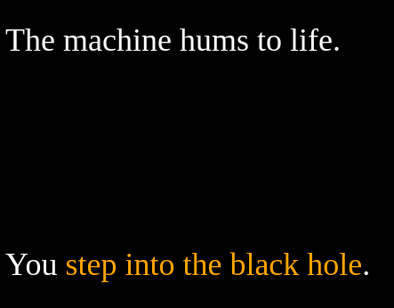

# Black Hole Station

## About the Game

Black Hole Station is a short adventure game where players explore an abandoned space station. As they solve the mystery of the black hole station, players collect items, repair the broken black hole machine, and encounter a mysterious stranger who may be the key to it all. Inspired by Outer Wilds and Ted Chiang's "The Merchant and the Alchemist's Gate," Black Hole Station conveys the idea that helping others is the best way to help yourself.

## Play Now

Play Black Hole Station [here](final_build/BlackHoleStation.html)

### Prototype

Play the prototype [here]

### Documentation

Read my Twine Developer Document [here]().

### Weekly Builds

Twine 1 [here](weekly_builds/Tutorial1.html)

Twine 2 [here](weekly_builds/Tutorial2.html)

Twine 3 [here](weekly_builds/Tutorial3.html)

Twine 4 [here](weekly_builds/Tutorial4.html)

Twine 5 [here](weekly_builds/Tutorial5.html)
